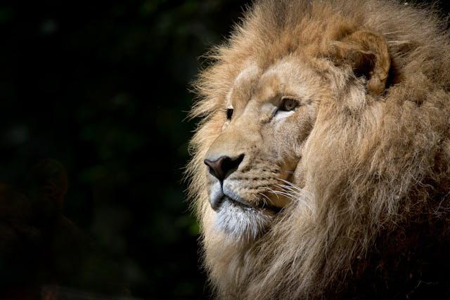
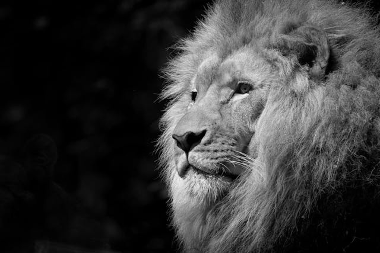
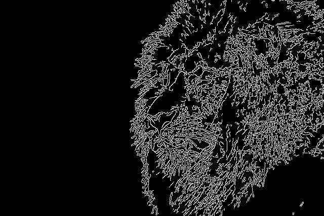
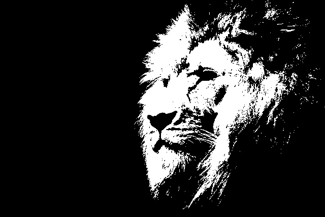
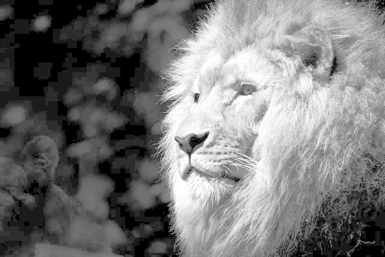

# 🟢 Basic Project – Image Filters with OpenCV

This project applies basic image processing filters using OpenCV to demonstrate fundamental computer vision operations.

## 🎯 Objective

- Apply basic image filters (grayscale, blur, edges, threshold, etc.)
- Write reusable, well-structured Python code
- Provide a Jupyter notebook to visualize results clearly
- Make the script flexible using command-line arguments

## 📂 Folder Structure

- input/ → Input image goes here (e.g. sample.jpg)
- output/ → Filtered images are saved here
- filters.py → Contains all filter functions
- main.py → Main script that applies the filters
- filters_demo.ipynb → Notebook to visualize results


## 🧪 Filters Available

- `apply_grayscale`: Converts image to grayscale  
- `apply_blur`: Applies Gaussian blur  
- `apply_canny`: Detects edges using the Canny method  
- `apply_threshold`: Applies binary thresholding  
- `apply_laplacian`: Applies Laplacian operator for edge detection  
- `apply_equalize_histogram`: Enhances contrast with histogram equalization  


## 🚀 How to Run

### Default (uses `input/sample.jpg`):
```bash
python main.py
```

### Custom image:
```bash
python main.py --input input/your_image.jpg
```

Make sure the image is placed inside the `input/` folder or provide the full relative path.

## 🖼️ Outputs


Here are a few examples of filters applied to the input image:

| Original | Grayscale | Gaussian Blur |
|----------|-----------|---------------|
|  |  |  |

| Canny Edges | Threshold | Histogram Equalization |
|-------------|-----------|------------------------|
|  |  |  |


## 📓 Notebook Preview

To visualize all results interactively, open `filters_demo.ipynb` using:

- **Visual Studio Code** (with Jupyter support built-in), or  
- Run in browser with:
  ```bash
  jupyter notebook filters_demo.ipynb
  ```


## 🛠️ Tech Stack
- Python 3.11+

- OpenCV

- Matplotlib

- Jupyter Notebook

- Argparse (for CLI input)