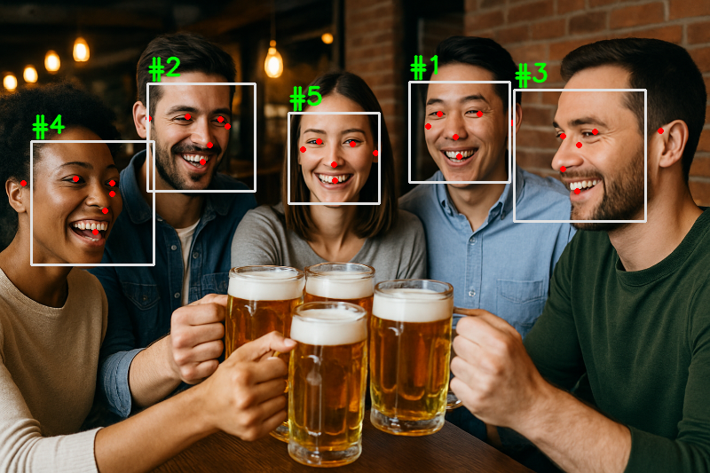
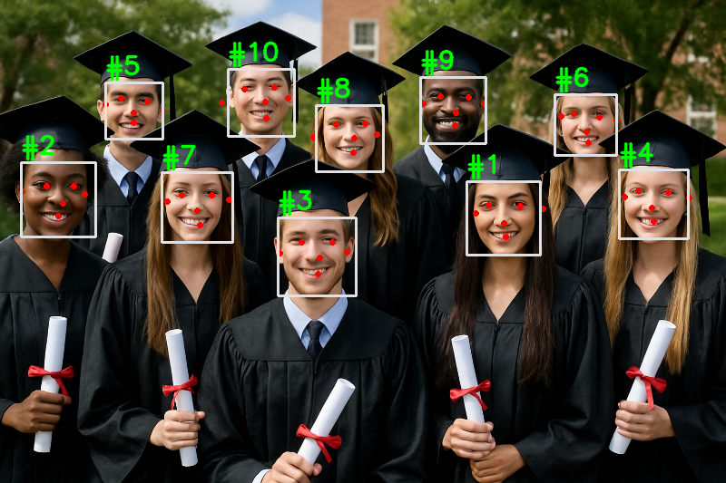
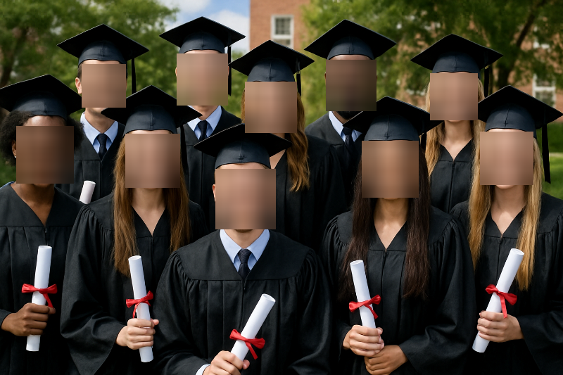
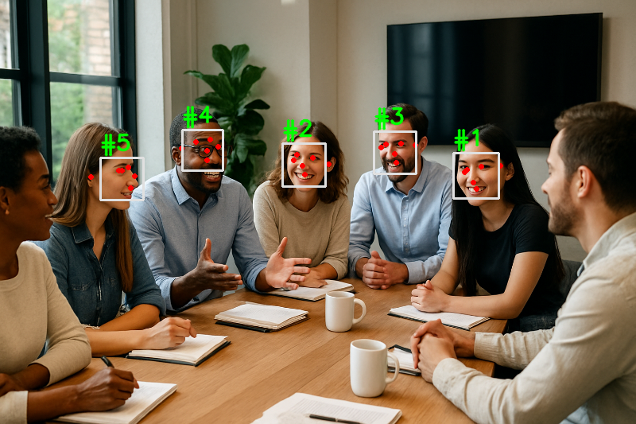

# 🟡 Intermediate Project – Face Detection with MediaPipe

This project allows to detect or blur faces automatically in images or using the camera in real time, using **MediaPipe** and **OpenCV**.

## 🎯 Objective

- 📷 Detect faces in images.
- 🌫️ Blur faces automatically.
- 🎥 Do it in real time from the webcam.
- 🧠 Interactive mode by console or CLI arguments.

## 📦 Requirements

- Python 3.10+
- pip


## 📂 Folder Structure

```
intermediate/
├── main.py                       ← Main entry point
├── face_detection_demo.ipynb     ← Project notebook
├── requirements.txt              ← Dependency list
├── input/                        ← Input images to process
│   ├── sample.jpg
├── output/                       ← Processed output images
│   ├── detected_sample.jpg
└── utils/
    └── face_utils.py             ← Face detection logic
```

## 🛠️ Installation Guide

Follow these steps to set up and run the face detection tool:

### 1. Clone the repository

```bash
git clone https://github.com/davidromeroy/computer-vision-portfolio.git
cd computer-vision-portfolio/intermediate
```

### 2. Create and activate a virtual environment

On windows:
```bash
python -m venv venv
venv\Scripts\activate
```

On macOS/Linux:
```bash
python3 -m venv venv
source venv/bin/activate
```

### 3. Install dependencies
```bash
pip install -r requirements.txt
```

### 4. Add input images
Place your image(s) inside the `input/` folder. For example:

```bash
input/
└── your_face_image.jpg
```

### 5. Run the program

🖐 **Interactive mode:**
```bash
python3 main.py
```
You will be asked:
- Which image to process (from the input/ folder, or you can type webcam).
- What action you want to perform (1 to detect, 2 to blur)
    
🖼 **Image mode with arguments:**

```bash
python3 main.py --input friends.png --mode detect
```

Or:

```bash
python3 main.py --input friends.png --mode detect
```
The image must be in the `input/` folder.

📸 **Direct webcam mode:**
```bash
python3 main.py --input webcam --mode detect
```
Or to blur:
```bash
python3 main.py --input webcam --mode blur
```

### 6. 📂 Output
Annotated image/video frames will be saved in the `output/` folder.
- `detected_friends.jpg`
- `blurred_friends.jpg`


<h2>📸 Visual Results - Static Images</h2>
<table style="width:100%; table-layout: fixed;">
  <thead>
    <tr>
      <th style="text-align:center;">Original</th>
      <th style="text-align:center;">Detection</th>
      <th style="text-align:center;">Blur</th>
    </tr>
  </thead>
  <tbody>
    <tr>
      <td></td>
      <td></td>
      <td></td>
    </tr>
    <tr>
      <td></td>
      <td></td>
      <td></td>
    </tr>
    <tr>
      <td></td>
      <td></td>
      <td></td>
    </tr>
  </tbody>
</table>


<h2>🎥 Results - Captures from Webcam</h2>

<table style="width:100%; table-layout: fixed;">
  <thead>
    <tr>
      <th style="text-align:center;">Original Webcam</th>
      <th style="text-align:center;">Detection</th>
      <th style="text-align:center;">Blur</th>
    </tr>
  </thead>
  <tbody>
    <tr>
      <td></td>
      <td></td>
      <td></td>
    </tr>
  </tbody>
</table>


## 🧑‍💻 Autor
David Romero Yánez
